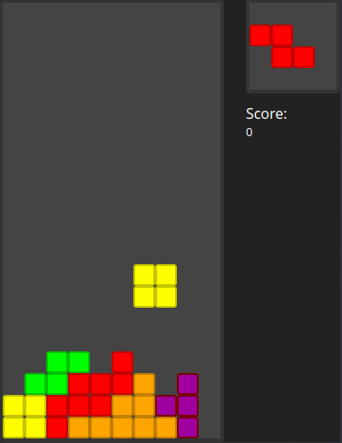

# Tetris Slint

A Tetris remake that's using [Slint](https://slint-ui.com) for the user interface.

## Showcase


*v1*


*v2 Light*


*v2 Dark*

## Usage

```
cargo run
```

### Controls
 - Move right and left: `Q - D / ← - →`
 - Rotate right: `Z / ↑ / C`
 - Rotate left: `X`
 - Drop: `S / ↓`
 - Hard-drop: `<Space>`
 - Hold: `H`

## Next Steps

 - Add a level system to gradually increase speed
 - Add touch buttons
 
## Credits

Thanks to [Wimble](https://dribbble.com/wimble) for [this](https://dribbble.com/shots/9976347-Neumorphic-Tetris) amazing Tetris UI design
